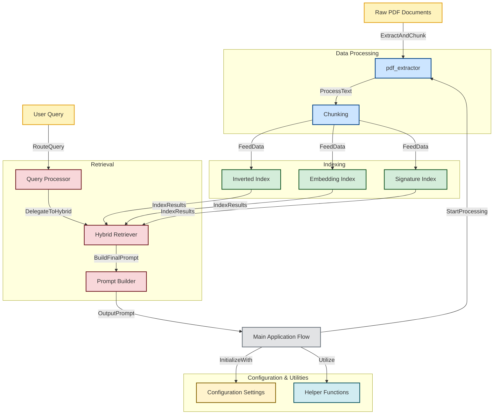

# Hybrid RAG LLM - System Architecture

This repository implements a **Hybrid Retrieval-Augmented Generation (RAG) System** for processing and retrieving information from PDF documents. Below is the architecture of the system:

## Integrating Traditional IR with Neural Retrieval for Enhanced Question Answering in Large Documents

1. Install all the required libraries from requirements.txt
2. Relocate pdf in data/
3. Gemini key in `config.py`


## System Overview



## Features
- **PDF Extraction**: Parses raw PDFs into extractable text data.
- **Text Chunking**: Splits extracted text into manageable chunks.
- **Multiple Indexing Strategies**: Uses **Inverted Index, Embedding Index, and Signature Index** for efficient retrieval.
- **Hybrid Retrieval**: Combines different search strategies for enhanced accuracy.
- **Query Processing**: Routes and processes user queries efficiently.
- **Prompt Generation**: Builds well-structured prompts for LLM interaction.
- **Configurable & Extensible**: Modular design with configurable settings and utilities.

## Installation
```sh
# Clone the repository
git clone https://github.com/aniike-t/hybridragllm.git
cd hybridragllm

# Install dependencies
pip install -r requirements.txt
```

## Usage
```sh
python main.py
```

## Directory Structure
```
├── data_processing/
│   ├── pdf_extractor.py
│   ├── chunking.py
├── indexing/
│   ├── inverted_index.py
│   ├── embedding_index.py
│   ├── signature_index.py
├── retrieval/
│   ├── query_processor.py
│   ├── hybrid_retriever.py
│   ├── prompt_builder.py
├── utils/
│   ├── helpers.py
├── config.py
├── main.py
└── README.md
```

## Contributing
Contributions are welcome! Feel free to submit a pull request or open an issue.

## License
This project is licensed under the MIT License.

